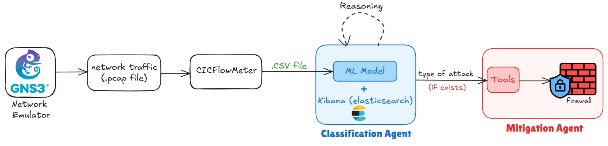

# Adaptive Network Defense System (ANDS)

## Project Overview
The Adaptive Network Defense System (ANDS) is an AI-powered cybersecurity platform designed to automatically detect, classify, and mitigate cyberattacks in real time. It replaces traditional static, signature-based defenses with dynamic behavioral analysis and intelligent response.

ANDS uses a Multi-Agent System (MAS) where several AI agents cooperate to monitor network traffic, detect anomalies, identify attack types, and apply mitigation strategies without human intervention.

## Objectives
- Monitor and extract features from network traffic in real time
- Detect and classify different types of cyberattacks using ML-backed detection
- Cross-correlate detections with historical data to reduce false positives  
- Automatically apply mitigation strategies (IP blocking, rate limiting, etc.)
- Reduce detection latency and response time to near-real-time speeds

## System Architecture
ANDS is built using a Multi-Agent System composed of two specialized agents:
1. **Classification Agent** — Detects and classifies attacks
2. **Mitigation Agent** — Applies automated responses

Network traffic passes through these agents in sequence: attack detection & classification, followed by automated mitigation.



## Core Agents

### Classification Agent (Fused Detection + Classification)
This agent performs both detection and classification of attacks in real time:
- Uses a trained machine learning model to classify network flows and determine attack types
- Correlates detections with historical alert data from Kibana to reduce false positives
- Combines model confidence with behavioral history for robust decision-making
- Outputs a **ClassificationResult** with attack type, confidence score, and source IP

### Mitigation Agent
This agent receives confirmed attack classifications and applies automated mitigation strategies:
- Currently focused on DDoS mitigation by blocking source IPs
- Applies firewall rules (iptables) on the target system to prevent further attacks
- Works idempotently — applying the same block twice has no adverse effects
- Can be extended to support additional mitigation types (rate limiting, traffic shaping, etc.)

## Datasets

ANDS is trained and evaluated on the improved versions of two well-known network intrusion datasets.
Raw dataset files are **not included** in this repository due to their size (~37 GB).

Download them from Kaggle and place the extracted CSVs under `data/raw/`:

| Dataset | Folder |
|---|---|
| Improved CICIDS2017 | `data/raw/CICIDS2017_improved/` |
| Improved CSE-CIC-IDS2018 | `data/raw/CSECICIDS2018_improved/` |

**Download link:** [Improved CICIDS2017 and CSE-CIC-IDS2018 on Kaggle](https://www.kaggle.com/datasets/ernie55ernie/improved-cicids2017-and-csecicids2018)

## Technologies
- Python
- Machine Learning and Deep Learning
- Multi-Agent Frameworks (CrewAI, AutoGen)
- Network Traffic Datasets (CIC-IDS2017, CSE-CIC-IDS2018)
- Firewall or Router APIs

## Challenges
- Requirement for large and high-quality network datasets
- Real-time processing constraints
- Avoiding false positives
- Integration with firewall systems

## Test Classification Agent

Run the classification agent on the sample test file (`data/test/test.csv`) with:

```bash
python -m src.main --mode csv --csv data/test/test.csv
```

Run the classification agent unit test suite with:

```bash
python -m pytest tests/test_intrusion_classification_agent.py -v
```

To see printed output and full details in the terminal:

```bash
python -m pytest tests/test_intrusion_classification_agent.py -v -s
```

Optional: save the output to a log file:

```bash
python -m pytest tests/test_intrusion_classification_agent.py -v -s > logs/test_output.txt
```

How to read results:
- `PASSED` means the test succeeded
- `FAILED` means at least one assertion failed
- Exit code `0` means all tests passed
- Exit code `1` means one or more tests failed

## Conclusion

ANDS represents a modern approach to cybersecurity by combining AI, multi-agent systems, and automation to build a self-defending network capable of responding to modern cyber threats in real time.

