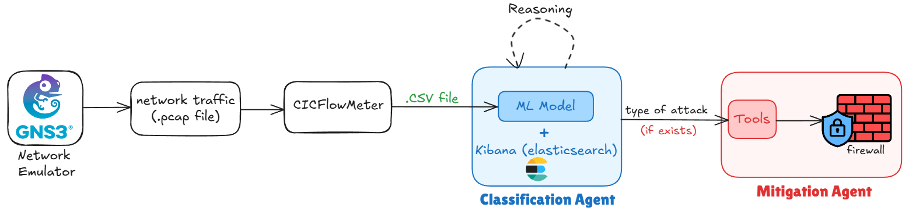

# Adaptive Network Defense System (ANDS)

## Project Overview
The Adaptive Network Defense System (ANDS) is an AI-powered cybersecurity platform designed to automatically detect, classify, and mitigate cyberattacks in real time. It replaces traditional static, signature-based defenses with dynamic behavioral analysis and intelligent response.

ANDS uses a Multi-Agent System (MAS) where several AI agents cooperate to monitor network traffic, detect anomalies, identify attack types, and apply mitigation strategies without human intervention.

## Objectives
- Monitor and extract features from network traffic in real time
- Detect and classify different types of cyberattacks using ML-backed detection
- Cross-correlate detections with historical data to reduce false positives  
- Automatically apply mitigation strategies (IP blocking, rate limiting, etc.)
- Reduce detection latency and response time to near-real-time speeds

## System Architecture
ANDS is built using a Multi-Agent System composed of two specialized agents:
1. **Classification Agent** — Detects and classifies attacks
2. **Mitigation Agent** — Applies automated responses

Network traffic passes through these agents in sequence: attack detection & classification, followed by automated mitigation.



## Core Agents

### Classification Agent (Fused Detection + Classification)
This agent performs both detection and classification of attacks in real time:
- Uses a trained machine learning model to classify network flows and determine attack types
- Correlates detections with historical alert data from Kibana to reduce false positives
- Combines model confidence with behavioral history for robust decision-making
- Outputs a **ClassificationResult** with attack type, confidence score, and source IP

### Mitigation Agent
This agent receives confirmed attack classifications and applies automated mitigation strategies:
- Currently focused on DDoS mitigation by blocking source IPs
- Applies firewall rules (iptables) on the target system to prevent further attacks
- Works idempotently — applying the same block twice has no adverse effects
- Can be extended to support additional mitigation types (rate limiting, traffic shaping, etc.)

## Datasets

ANDS is trained and evaluated on the improved versions of two well-known network intrusion datasets.
Raw dataset files are **not included** in this repository due to their size (~37 GB).

Download them from Kaggle and place the extracted CSVs under `data/raw/`:

| Dataset | Folder |
|---|---|
| Improved CICIDS2017 | `data/raw/CICIDS2017_improved/` |
| Improved CSE-CIC-IDS2018 | `data/raw/CSECICIDS2018_improved/` |

**Download link:** [Improved CICIDS2017 and CSE-CIC-IDS2018 on Kaggle](https://www.kaggle.com/datasets/ernie55ernie/improved-cicids2017-and-csecicids2018)

## Technologies
- Python
- Machine Learning and Deep Learning
- Multi-Agent Frameworks (CrewAI, AutoGen)
- Network Traffic Datasets (CIC-IDS2017, CSE-CIC-IDS2018)
- Firewall or Router APIs

## Quick Start (Full Stack Setup & Run)

This section guides you through running the entire ANDS platform, including the Elasticsearch memory, the FastAPI backend, and the React frontend dashboard.

### 1) Environment Configuration (`.env`)

Create a `.env` file in the root directory. This configures the backend, the Large Language Model provider, and the connection to the SIEM (Elasticsearch). Your `.env` should look like this:

```env
# LLM Provider Configuration
LLM_PROVIDER=anthropic          # Options: anthropic | openai | ollama
LLM_MODEL=claude-3-opus-20240229
ANTHROPIC_API_KEY=your_api_key_here

# SIEM Backend (Elasticsearch/Kibana)
USE_SIEM_HISTORY="True"         # Must be True to enable historical memory
KIBANA_HOST=http://localhost:9200
KIBANA_INDEX=ands-alerts
KIBANA_VERIFY_CERTS=0

# Mitigation Auto-Pilot
AUTO_MITIGATE="False"           # Set to True for automatic containment via iptables
```

### 2) Start Elasticsearch & Kibana (Docker)

The backend requires Elasticsearch to maintain its historical cyberattack memory. You must start the Docker containers **before** running the backend.

```powershell
# From the project root, start the containers in detached mode:
docker compose up -d

# Check if they are healthy:
docker compose ps
curl http://localhost:9200/
```
Wait a few seconds for the `curl` command to return the Elasticsearch cluster information, confirming it's ready.

### 3) Start the FastAPI Backend

With Elasticsearch running, activate your Python virtual environment, install dependencies, and launch the backend controller.

```powershell
# Create and activate environment
python -m venv .venv
& ".\.venv\Scripts\Activate.ps1"

# Install backend dependencies
& ".\.venv\Scripts\python.exe" -m pip install -r requirements.txt

# Launch the FastAPI server
& ".\.venv\Scripts\python.exe" -m uvicorn src.api:app --reload --port 8000
```
*Note: If the backend throws a `ConnectionRefusedError: [WinError 10061]`, it means your Docker Elasticsearch container is not running or not healthy yet.*

### 4) Start the Application Frontend (React/Vite)

In a **new terminal tab**, navigate into the frontend folder to serve the real-time monitoring dashboard.

```powershell
cd frontend
npm install
npm run dev
```
Open the URL provided by Vite (typically `http://localhost:5173`) in your browser to view the ANDS dashboard.

---

## Alternative/Standalone CLI Modes

## Challenges
- Requirement for large and high-quality network datasets
- Real-time processing constraints
- Avoiding false positives
- Integration with firewall systems

## Test Classification Agent

The commands below were validated in this workspace on Windows using the project virtual environment.

### 1) Run classification on sample CSV input

This runs the classification pipeline on `data/test/test.csv` and prints predictions in the terminal.

```powershell
& ".\.venv\Scripts\python.exe" -m src.main --mode csv --csv data/test/test.csv
```

Expected behavior:
- Benign flows are reported as `BENIGN`
- Attack flows are reported with specific attack types (for example: `DDoS`, `PortScan`, `WebAttack`)

### 2) Run classification-agent unit tests

Run the test suite with:

```powershell
& ".\.venv\Scripts\python.exe" -m pytest tests/test_intrusion_classification_agent.py -v
```

Current expected result in this repo:
- `11 passed`
- Exit code `0`

### 3) Optional: print all test output

```powershell
& ".\.venv\Scripts\python.exe" -m pytest tests/test_intrusion_classification_agent.py -v -s
```

### 4) Optional: save test output to a log file

```powershell
& ".\.venv\Scripts\python.exe" -m pytest tests/test_intrusion_classification_agent.py -v -s > logs/test_output.txt
```

### 5) Optional: regenerate attack-type centroids in the PCA model bundle

If you retrain/rebuild data artifacts and want attack-type fallback metadata in
`deployments/models/pca_intrusion_detector.joblib`, run:

```powershell
& ".\.venv\Scripts\python.exe" scripts/build_attack_type_centroids.py --model deployments/models/pca_intrusion_detector.joblib
```

Notes:
- This command creates a backup file: `deployments/models/pca_intrusion_detector.joblib.bak`
- The updated bundle includes `attack_type_centroids` and `attack_classes`
- A sidecar file is also written: `deployments/models/pca_intrusion_detector.attack_type_centroids.json`

Troubleshooting (if attacks show as `Intrusion` instead of specific types):
- Confirm you are loading the expected model path from logs.
- Regenerate centroid metadata with the command above.
- Ensure `deployments/models/pca_intrusion_detector.attack_type_centroids.json` exists.
- Re-run with the project venv Python:

```powershell
& ".\.venv\Scripts\python.exe" -m src.main --mode csv --csv data/test/test.csv
```

How to read results:
- `PASSED` means the test succeeded
- `FAILED` means at least one assertion failed
- Exit code `0` means all tests passed
- Exit code `1` means one or more tests failed

## Conclusion

ANDS represents a modern approach to cybersecurity by combining AI, multi-agent systems, and automation to build a self-defending network capable of responding to modern cyber threats in real time.

